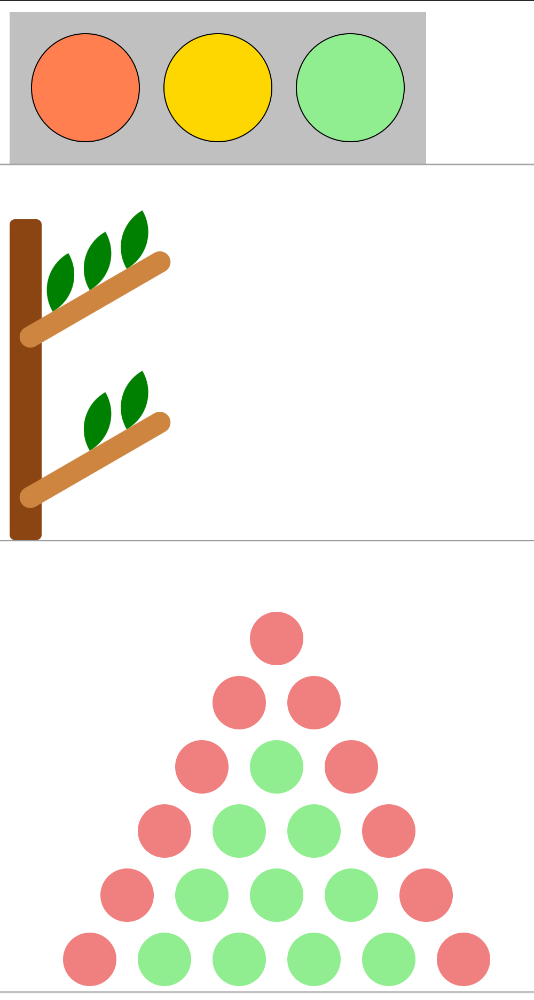
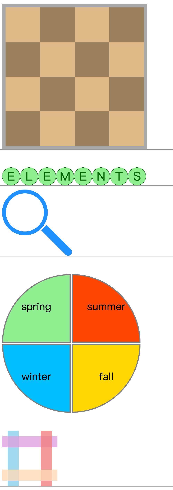
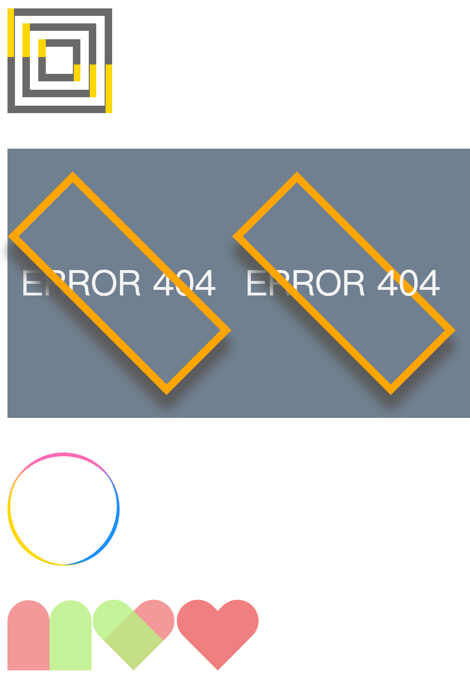
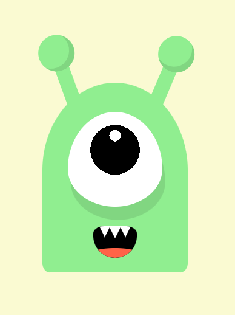
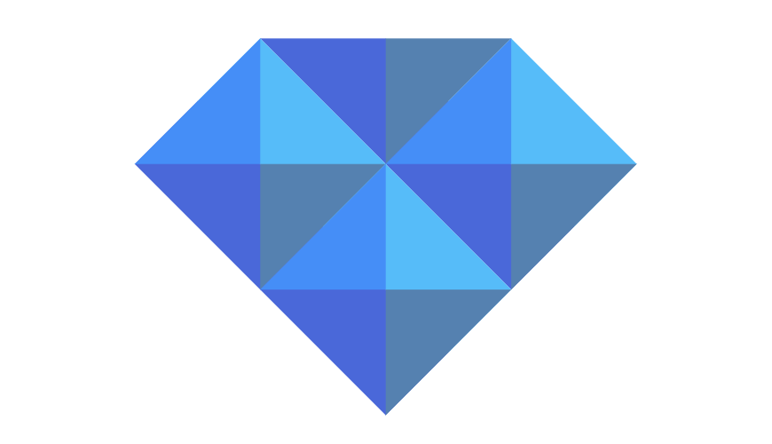
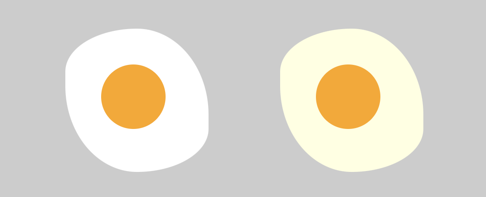
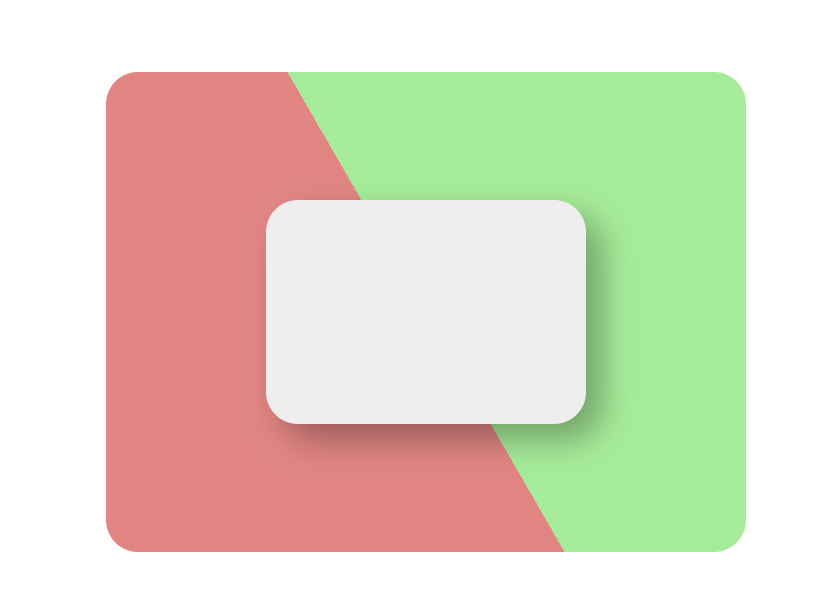
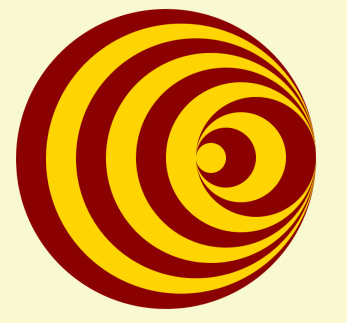

# Pure-CSS3

## Ch1




- 杨辉三角的那个第一个和最后一个子元素的确是个 `trick`

```css
.triangle div span:first-child,
.triangle div span:last-child {
  background-color: lightcoral;
}
```

- 棋盘这个 奇偶子元素有意思

```css
.chessboard div:nth-child(odd) span:nth-child(even),
.chessboard div:nth-child(even) span:nth-child(odd) {
  background-color: rgba(0, 0, 0, 0.3);
}
```

## Ch2





## Ch05 阴影


## Ch06 剪切、滤镜和色彩混合

## 07 变量与计数器



- 拿4个变量给四个小矩形的4个边框分别上色
- 然后旋转45°
- 最后把超出的边框的部分透明色


- `background` 使用三重属性叠加，实现了 `a single div` 💘
- 使用 `clip-path: polygon` 对杯子整体切边，精妙 🎈
- 最后使用变量后，把复杂的结构拆分，语义化更强，代码更易读懂 ✅



> 一个刚打的鸡蛋，一个快熟的鸡蛋

- `css`的变量也是有作用域之分的，从当前开始找直到 `:root` 域，“谁近就用谁”
- `border-radius: 50% / 30% 60%;`



```css
background-image: linear-gradient(
  60deg,
  lightcoral 50%,
  lightgreen 50%
);
```

- 斜60°分割的画法
- 可能用calc计算来居中会快点



```css
.eye div:nth-child(1) { --n: 1; }
.eye div:nth-child(2) { --n: 2; }
.eye div:nth-child(3) { --n: 3; }
.eye div:nth-child(4) { --n: 4; }

 --diameter: calc(10em - (var(--n) - 1) * 1em);
```

- 通过预先设置 “坑位”，然后向作用域内注入变量激活坑位
- 通过变量套变量，激活子元素动画
