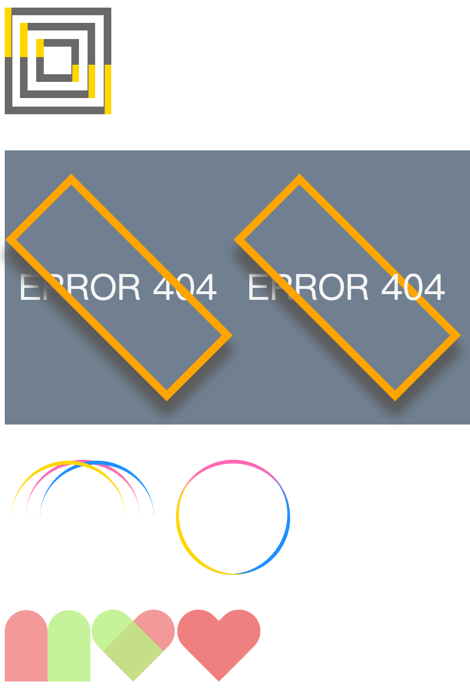
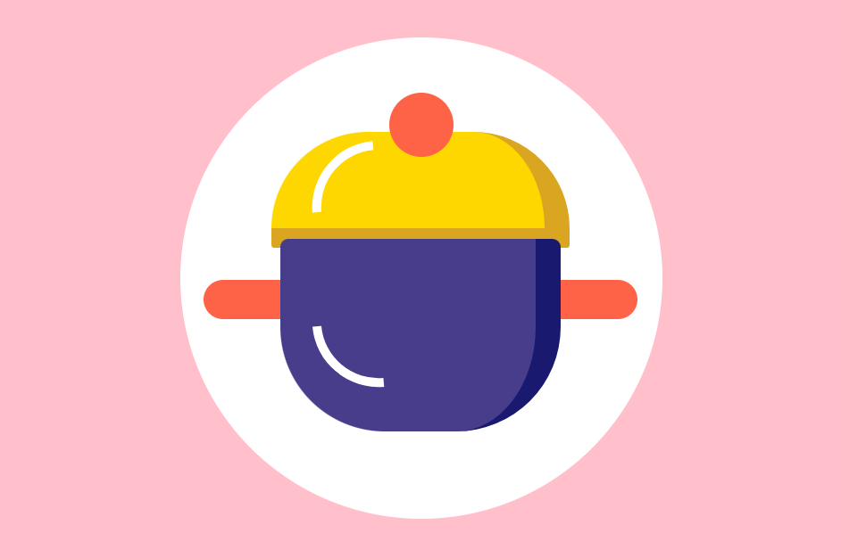

# Pure-CSS3

## Ch1


- 杨辉三角的那个第一个和最后一个子元素的确是个 `trick`

```css
.triangle div span:first-child,
.triangle div span:last-child {
  background-color: lightcoral;
}
```

- 棋盘这个 奇偶子元素有意思

```css
.chessboard div:nth-child(odd) span:nth-child(even),
.chessboard div:nth-child(even) span:nth-child(odd) {
  background-color: rgba(0, 0, 0, 0.3);
}
```

## Ch2





## Ch05 阴影


## Ch06 剪切、滤镜和色彩混合

## 07 变量与计数器


- 拿4个变量给四个小矩形的4个边框分别上色
- 然后旋转45°
- 最后把超出的边框的部分透明色
